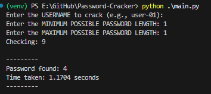
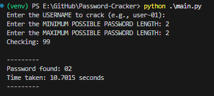
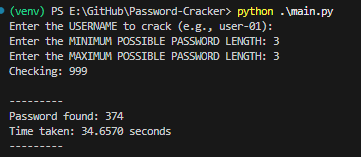
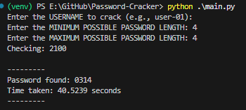

# Password-Cracker  
Brute Force Password Cracker written in Python. Tested against Argon2 hashes.  

## USAGE  
1. Clone this repo.  
2. In the project root directory, run:  
    1. `python -m venv venv` to create a Python virtual environment.  
    2. `venv\\Scripts\\activate.bat` on Windows or `source venv/bin/activate` on Linux to activate the virtual environment.  
    3. `pip install -r requirements.txt` to install project dependency packages.  
    4. `python gen_argon2_passwd_file.py` and follow prompts (or press ENTER for defaults) to generate a sample password test file.  
    5. `python main.py` to find default user's password or `python main.py -h` for usage help.  

## SAMPLE TEST RESULTS  
### Password Length 1  
  

### Password Length 2  
  

### Password Length 3  
  

### Password Length 4  
  
